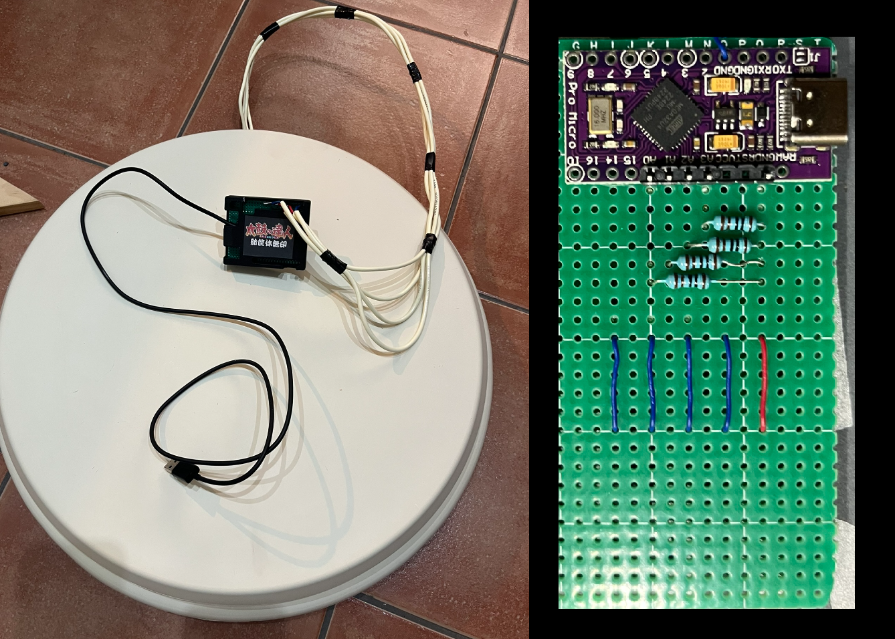

# 太鼓ドラムコントローラー - Arduino Pro Micro (ATmega32U4)

自分の**太鼓の達人**アーケードコントローラーをPC用に作成するためのオープンソースハードウェアプロジェクトです。

[簡体字版はこちら](./README_zh-Hans.md) | [繁体字版はこちら](./README_zh-Hant.md) | [View English Version](./README.md)

## プロジェクトについて

このプロジェクトは、あなたが自宅でハードウェアの太鼓を開発する手助けをすることを目的としています。

> **注意：** このプログラムは個人及び非商業的な利用のみを目的としています。

---

## 必要なもの

1. **Arduino Micro/Leonardo**（ATmega32U4搭載）
2. **4つの圧電センサー**
3. **4つの100kΩ抵抗**
4. 必要な電子部品（ブレッドボード、ジャンパーワイヤーなど）
5. 木材と切断工具（太鼓を一から作成する場合のみ必要）  
   > もしアフターマーケットのTaiko Force Lv5があれば、それを直接使用できます。

---

## コントローラーの作り方

1. **ドラムを作成する**  
   ドラムを作り、4つの圧電センサーをしっかりと接着します。センサーの推奨位置は以下の画像を参考にしてください。

   

2. **コンポーネントを接続する**  
   圧電センサーや他のコンポーネントを次のようにコントローラーに接続します。  
   > 注意：圧電センサーの極性は関係ありません。このスキームはArduino Microボード用です。異なるボードを使用する場合は、そのドキュメントを参照してください。

   

3. **ファームウェアをフラッシュする**  
   ボードにファームウェアをフラッシュします。  
   `SAMPLE_CACHE_LENGTH`、`HIT_THRES`、`RESET_THRES`、および`sensitivity`などのパラメータを微調整する必要があるかもしれません。詳細は次のセクションを参照してください。

4. **楽しんでください！**  
   セットアップが完了したら、ゲームをお楽しみください。

---

## パラメータの調整

1. **ヒットおよびリセット閾値**  
   `DEBUG 1`を設定して（これによりキーボード出力が無効になり、シリアルポートから信号値が送信されます）、ファームウェアをフラッシュし、ドラムの4つのエリアのいずれかを叩いて、シリアルモニターの出力グラフを視覚化します。  
   - **ヒット閾値**：最も強いヒットよりも低く設定します。
   - **リセット閾値**：ヒット間の谷よりも大きく、ヒット値よりも低い必要があります。  

   残りの3つのエリアについてもこのプロセスを繰り返し、最適な値を見つけてください。

   

2. **サンプリング長**  
   最大実行速度を実現するために、`cache.h`ライブラリは`SAMPLE_CACHE_LENGTH`のウィンドウサイズを2の冪に最適化しています（例：2、8、16、32など）。実際には、Arduinoに対して**16**が最適な値ですが、入力を4000Hz以上でサンプリングする強力なマイクロコントローラを使用している場合は、**32**に変更して、より滑らかな（つまり、ノイズの少ない）曲線を得ることができます。

3. **感度**  
   すべての圧電センサーが同じではなく、取り付けエラーのために4つのセンサーからの信号が大きく異なることがあります。感度値は差異を正規化するための乗数です。たとえば、右ドンエリアが他の3つよりもはるかに高い値を生成する場合、`sensitivity`を`{1.0, 1.0, 0.5, 1.0}`に調整して問題を解決できます。

   

   > センサーの取り付けは非常に重要です。センサーがしっかりと木材に取り付けられ、正しい位置にあることを確認してください。

4. **ゲームを起動して楽しむ**  
   調整が完了したら、ゲームを起動し、自分だけのカスタム太鼓コントローラーを楽しんでください！

---
